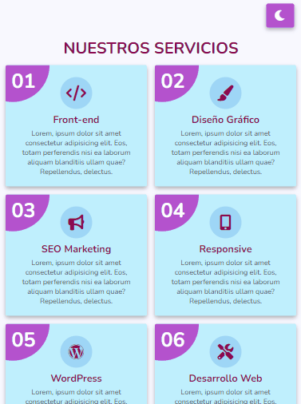

# Tarjetas de Servicios Responsivas (light/dark)

Proyecto de tarjetas de servicios, completamente responsivas, incluye cambio de tema, de claro a oscuro.

La idea original fue sacada de [Mr. Web Designer](https://www.youtube.com/watch?v=NSHAz7hfN8s).

El proyecto fue adaptado a SCSS y a diferencia de la versión original que utilizó flexbox para el ordenamiento de las tarjetas, aquí se hace uso de _Grid CSS_.

## Resultado final del proyecto

### Enlace a la página en vivo

https://esdjl-responsive-services-cards.netlify.app/

### Versión para móvil


### Versión para tablet



### Versión de escritorio


### Tecnologías utilizadas

- HTML5
- SCSS
- JavaScript

## Cómo realizar modificaciones

1. Clonar el repositorio:

```
git clone https://github.com/ESaulDJLaguna/responsive-services-cards-dark_light.git
```

2. Acceder a la carpeta generada:

```
cd responsive-services-cards-dark_light/
```

3. Instala las dependencias:

```
npm install
```

4. Transpila el archivo _style.scss_. El siguiente comando generará los estilos _CSS_ y se mantendrá en modo observador:

```
npm run sass
```

5. Abre el archivo _index.html_ en un navegador.
